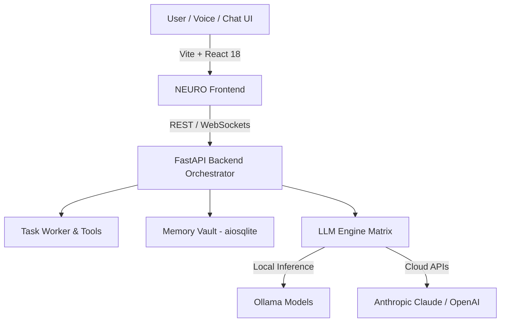

# 🧠 NEURO - AI Second Brain & Autonomous Agent Workspace

<div align="center">


<p align="center">
  <strong>An intelligent, privacy-first AI second brain and autonomous agent orchestration platform.</strong>
  <br />
  Featuring multi-modal voice interfaces, cognitive reasoning loops, persistent memory indexing, and background task automation.
</p>

</div>

---

## 🌟 Key Features

### 💬 1. Conversational Engine & Voice Mode
- **Real-Time AI Chat**: Multi-turn dialogue with streaming responses, syntax highlighting, and rich Markdown rendering.
- **🎙️ Voice Mode**: Hands-free real-time voice conversations with speech-to-text input and natural auditory feedback.
- **🔄 Thinking Loop**: Visualized cognitive reasoning steps that display multi-agent thought chains before generating responses.

### 🧠 2. Memory Vault & Knowledge Retrieval
- **Persistent Context**: Long-term memory store using SQLite/aiosqlite for contextual conversation recall.
- **Contextual Search**: Fast semantic filtering and memory lookup across past sessions and stored thoughts.

### ⚙️ 3. Engine Matrix & Multi-LLM Orchestration
- **Flexible Model Routing**: Connect seamlessly to local LLMs (via **Ollama**) or cloud APIs (Anthropic Claude, OpenAI, etc.).
- **Live Latency & Token Telemetry**: Monitor token usage, processing time, and active engine states.

### ⚡ 4. Automation Queue & Background Agents
- **Autonomous Task Scheduling**: Queue tasks for autonomous execution in the background.
- **Worker Pipeline**: Multi-step automated workflows with real-time status tracking and execution logs.

### 🛠️ 5. Developer Tools & Studio
- **API Studio**: Built-in sandbox for inspecting, creating, and executing API calls and custom tool integrations.
- **Presentation Generator**: Automated slide deck generation from natural language topics and prompts.

---

## 🏗️ Architecture Overview



---

## 📁 Repository Structure

```
Nuro/
├── backend/                  # FastAPI backend server
│   ├── core/                 # Core engine logic & orchestration
│   ├── database.py           # aiosqlite persistence & schema models
│   ├── main.py               # FastAPI application entrypoint
│   ├── orchestrator.py       # Multi-agent LLM routing & execution
│   ├── task_worker.py        # Background task queue worker
│   ├── tools.py              # Extensible agent tools & API integrations
│   └── requirements.txt      # Python dependencies
├── src/                      # React frontend source code
│   ├── components/
│   │   ├── ApiStudio.jsx            # API testing & developer sandbox
│   │   ├── AutomationQueue.jsx      # Background automation scheduler
│   │   ├── ChatInterface.jsx        # Conversational UI & message streaming
│   │   ├── EngineMatrix.jsx         # Model selection & metrics
│   │   ├── MemoryVault.jsx          # Context & memory storage
│   │   ├── PresentationGenerator.jsx# AI slide deck creator
│   │   ├── SettingsPanel.jsx        # Config & credentials manager
│   │   ├── ThinkingLoop.jsx         # Step-by-step reasoning visualizer
│   │   └── VoiceMode.jsx            # Hands-free speech interface
│   ├── App.jsx               # Main React layout
│   ├── index.css             # Glassmorphic dark design system
│   └── main.jsx              # React DOM root
├── Start_NEURO_App.vbs       # 1-Click silent Windows launcher
├── start.bat                 # Windows startup script
├── package.json              # Node.js project & dependencies
└── vite.config.js            # Vite build configuration
```

---

## 🚀 Quick Start Guide

### Prerequisites
- **Node.js**: `v18.0+`
- **Python**: `3.10+`
- **Ollama** *(Optional for local AI models)*: [Download Ollama](https://ollama.com/download)

---

### ⚡ 1-Click Launch (Windows)
Double-click [`Start_NEURO_App.vbs`](file:///d:/Code%20paradox/Code/Antigravity/Nuro/Start_NEURO_App.vbs) or [`start.bat`](file:///d:/Code%20paradox/Code/Antigravity/Nuro/start.bat).
Both frontend and backend will spin up automatically and launch `http://localhost:5173` in your browser.

---

### 🛠️ Manual Installation & Launch

#### 1. Backend Setup
```bash
cd backend
python -m venv venv

# Windows:
venv\Scripts\activate
# Linux/macOS:
# source venv/bin/activate

pip install -r requirements.txt
python main.py
```
> The backend server runs on `http://127.0.0.1:8000`.

#### 2. Frontend Setup
```bash
# In the root Nuro directory:
npm install
npm run dev
```
> The frontend application runs on `http://localhost:5173`.

---

## ⚙️ Environment Configuration

Create a `.env` file in the `backend/` directory:

```env
# Optional Cloud LLM API Keys
ANTHROPIC_API_KEY=your_anthropic_key_here
OPENAI_API_KEY=your_openai_key_here

# Local LLM Endpoint (Default: Ollama)
OLLAMA_HOST=http://localhost:11434
```

---

## 🤝 Contributing

Contributions are welcome! To contribute:
1. Fork the Project
2. Create your Feature Branch (`git checkout -b feature/AmazingFeature`)
3. Commit your Changes (`git commit -m 'feat: add AmazingFeature'`)
4. Push to the Branch (`git push origin feature/AmazingFeature`)
5. Open a Pull Request

---

## 📄 License

Distributed under the MIT License. See `LICENSE` for more details.
